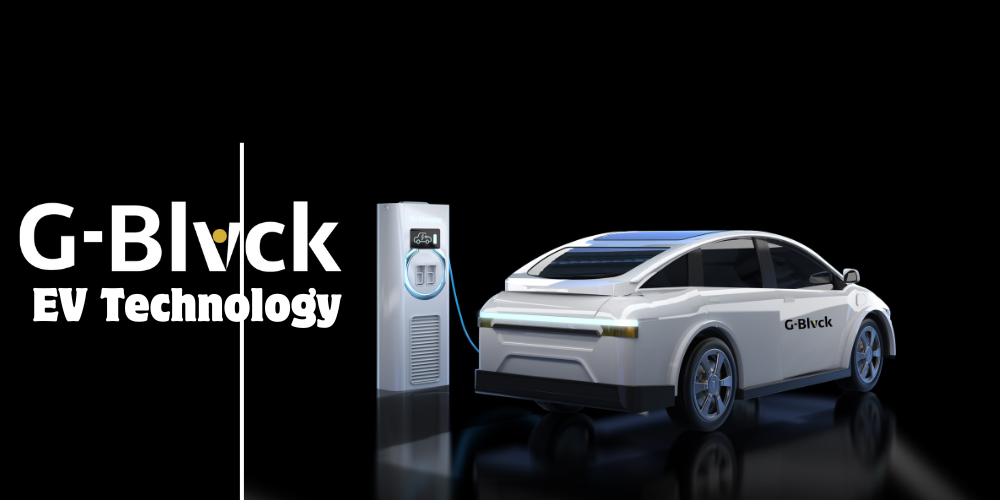

# EV Technology

<figure><figcaption></figcaption></figure>

In response to this pressing environmental challenge, **G-Blvck** has emerged as a vanguard of sustainable luxury transportation. We have meticulously curated a fleet of **cutting-edge electric vehicles (EVs)** and **hybrid models**, designed to deliver an unparalleled travel experience while safeguarding the planet. Our zero-emission EVs, including the Tesla Model S and Audi e-Tron, glide silently through city streets, leaving behind no trace of pollutants. For those who seek a balance between tradition and innovation, our hybrid offerings combine fuel efficiency with reduced emissions, ensuring a seamless transition to a greener future.

Beyond our vehicles, we have embedded sustainability into the very fabric of our operations. Through **carbon offset programs**, we neutralize the environmental impact of every ride, channeling resources into reforestation and renewable energy projects. We also empower our clients to make eco-conscious choices by incentivizing the selection of electric and hybrid vehicles, offering exclusive benefits such as priority booking and tailored perks. By choosing **Elite Taxi Service**, you are not merely opting for luxury—you are embracing a vision of sustainability, where opulence and environmental stewardship coexist harmoniously.
